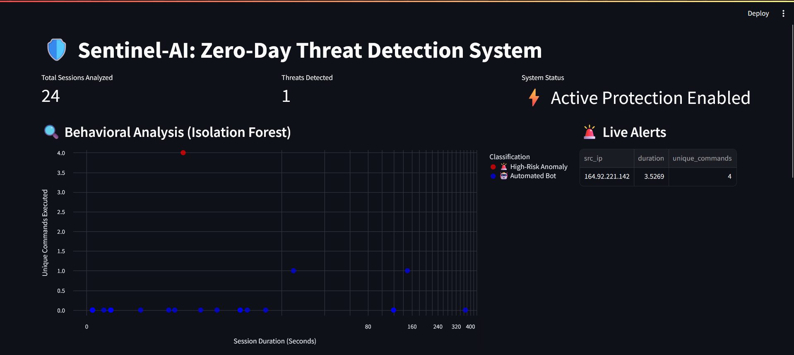
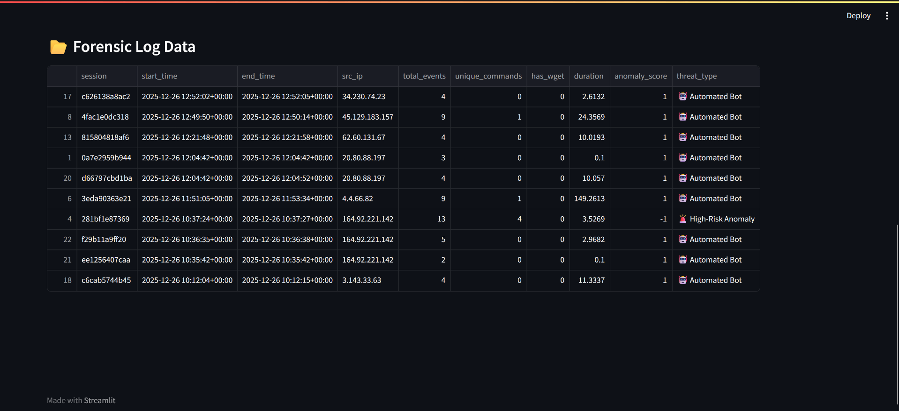

# 🛡️ Sentinel-AI: Zero-Day Threat Detection System

### 🚀 Overview
Sentinel-AI is an end-to-end Threat Intelligence System that combines a **Cowrie Honeypot** (deployed on AWS EC2) with an **Unsupervised Machine Learning Engine** (Isolation Forest) to detect human adversaries in real-time.

Unlike traditional firewalls that use static rules, Sentinel-AI analyzes behavioral patterns (session entropy, command latency, and typing speed) to identify "Zero-Day" anomalies that bypass standard signatures.

### 🏗️ Architecture
1. **The Trap:** AWS EC2 instance running Cowrie (SSH Honeypot) on Port 22.
2. **The Pipeline:** Python automation (`paramiko`) to securely sync JSON logs to a local analysis engine.
3. **The Brain:** Scikit-Learn `IsolationForest` model trained on 200+ attack sessions to separate Botnets from Human APTs.
4. **The Face:** Streamlit Dashboard with Altair visualizations for real-time threat monitoring.

### 🛠️ Tech Stack
* **Cloud:** AWS EC2, Ubuntu Linux
* **Cybersecurity:** Cowrie (Honeypot), SSH Tunneling, Port Forwarding
* **Data Science:** Python, Pandas, Scikit-Learn (Anomaly Detection)
* **Visualization:** Streamlit, Altair

### 📸 Screenshots
**1. Live Threat Dashboard**

*Real-time visualization of incoming attacks classified by the Machine Learning engine.*

**2. Forensic Logs**

*Detailed capture of session duration, unique commands, and attack vectors.*
